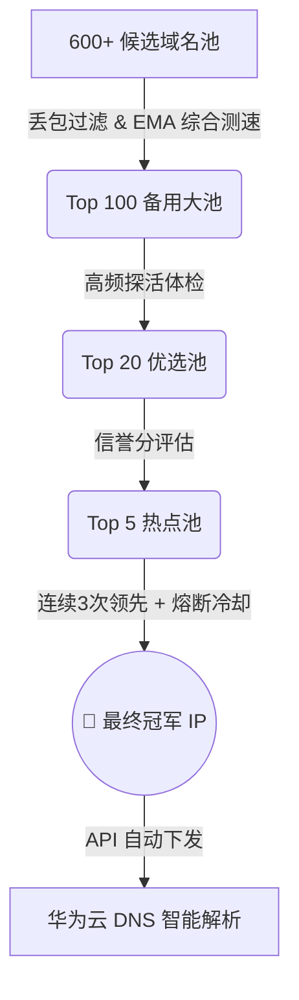

# 🚀 Cloudflare 智能优选 DNS 监控与分流系统


基于 VPS789 平台历史大数据，全自动选出丢包最低、抖动最小、三网综合最优的 Cloudflare 优选 IP/CNAME。并通过华为云 DNS API 实现电信、移动、联通三网智能分流。

配合 **GitHub Actions 全自动化** 和 **高颜值可视化监控看板**，彻底解放双手，实现 DNS 容灾的“自动驾驶”。

🔗 **[点击查看在线高颜值监控看板](https://godeluoo1.github.io/cf-dns/status.html)**

## ✨ 核心特性

- 🌌 **极致视觉体验**: 自动生成“深空玻璃拟物风 (Glassmorphism)”的监控面板，自带悬浮微动效、数据渐变高亮与红绿灯熔断警告。
- 🤖 **全自动托管 (GitHub Actions)**: 抛弃繁琐的 VPS 部署，完全免费托管在 GitHub Actions。每 6 小时自动苏醒抓取数据并部署网页，测试数据会通过 Commit 自动永久保存！
- ⚖️ **EMA 加权评分模型**: `1000×丢包 + 50×抖动 + 0.7×延迟`，近 7 天数据权重显著高于历史，更注重大池稳定性。
- 🛡️ **严格防抖与熔断**: 候选节点需“连续 3 次领先”才能上位，现任节点一旦失联，立刻从 Top5→Top20→Top100 逐级降级熔断。
- 🗃️ **三网满编备用池**: 为电信、联通、移动及综合默认线路分别构建独立的 Top100 备用节点池，冗余度极高。

## 🏗️ 核心漏斗架构



## 🚀 极简部署方案 (推荐: GitHub Actions 完全免费版)

这是目前最优雅的运行方式，**零服务器成本**，数据永久保存：

1. **Fork/Clone** 本仓库到你的私人账户（**强烈建议设置为 Private 仓库**，保护你的 API 密钥）。
2. 去你的 GitHub 仓库设置 `Settings` -> `Secrets and variables` -> `Actions`，添加以下环境变量：
   - `HUAWEICLOUD_AK` : 华为云 Access Key
   - `HUAWEICLOUD_SK` : 华为云 Secret Key
3. 赋予 GitHub Actions 读写权限：进入 `Settings` -> `Actions` -> `General` -> 勾选 `Read and write permissions`。
4. 去 `Actions` 页面手动点击 **Run workflow** 触发一次。
5. 去 `Settings` -> `Pages`，将 Source 设置为 `Deploy from a branch`，Branch 选择 `gh-pages` 目录选 `/ (root)`。
6. 等待几分钟，你的炫酷监控面板就自动上线了！

## ⚙️ 个性化配置

在 `cf.py` 顶部修改你的专属域名和监测敏感度：

```python
DOMAIN = "你的主域名.com"

# 每个子域名独立配置测速维度
SUB_DOMAINS_CONFIG = {
    "cf": 1,  # 使用 30 天长期稳定维度 (推荐给建站)
    "vip": 0, # 使用 24 小时高灵敏维度 (推荐给代理)
}
```

## 🔒 安全须知
- 绝对不要在代码中硬编码任何 AK/SK。
- 必须通过 GitHub Secrets 注入凭证。
- 定期在云服务商后台轮换你的 API 密钥。
